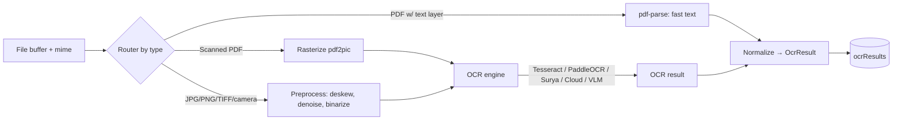
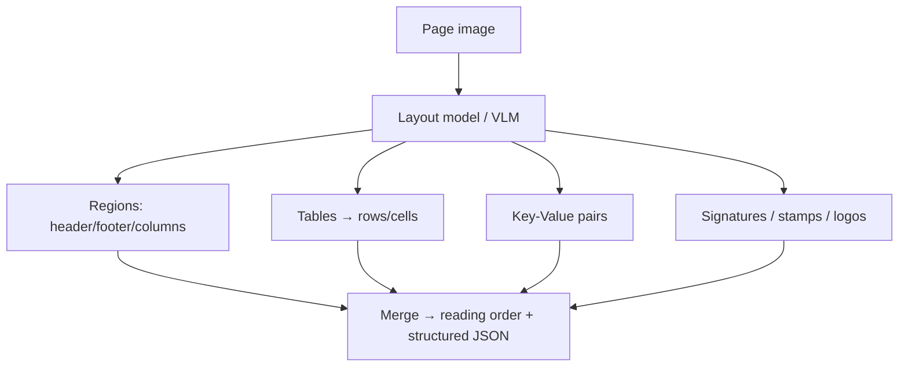
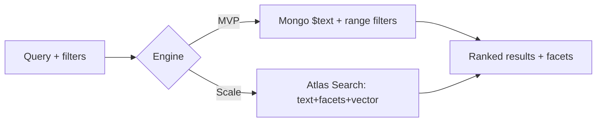
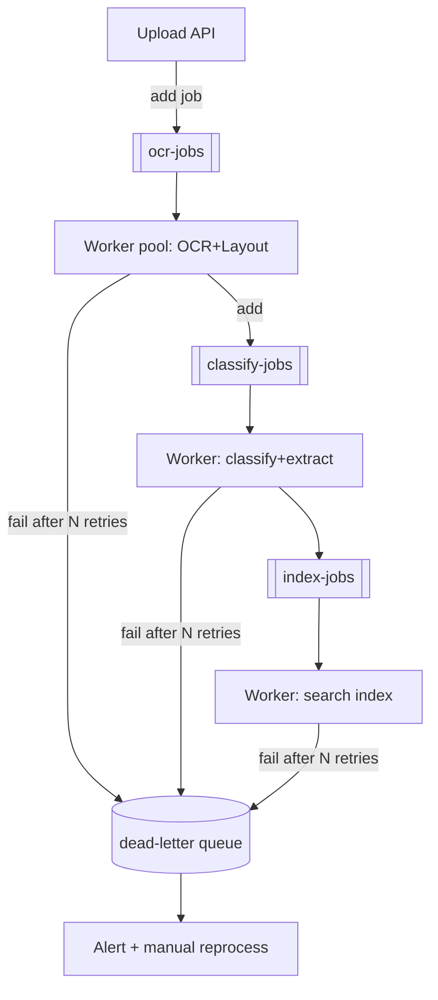
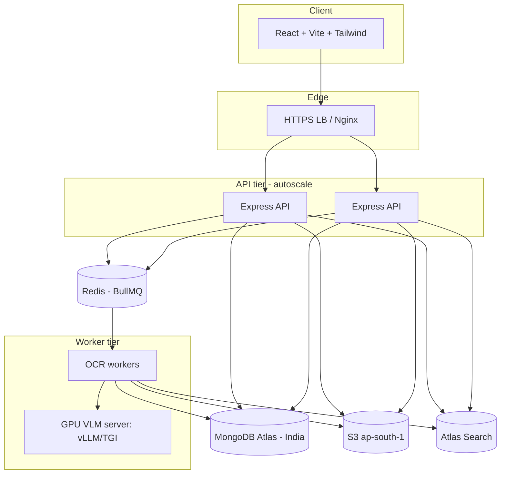

# FlowSphere — AI OCR & Document Intelligence Architecture

> Target stack: React + Vite + Tailwind · Node.js + Express · MongoDB + Mongoose ·
> Local storage (dev) / AWS S3 (prod) · JWT auth · BullMQ + Redis workers.
> Region: India (DPDP 2023 aligned).

This document specifies how to replace template-based OCR with a modern,
layout-aware **document intelligence** pipeline, and maps every piece to the
**current FlowSphere implementation** so it can be adopted incrementally.

---

## 0. Where FlowSphere is today (baseline)

| Capability | Current implementation | This doc upgrades it to |
| --- | --- | --- |
| OCR | `pdf-parse` (text layer) + optional Tesseract (`server/src/ocr.js`) | Pluggable OCR provider: Tesseract / PaddleOCR / Surya / Cloud / VLM |
| Layout | none (flat text) | Layout analysis (tables, KV pairs, regions) |
| Classification | NVIDIA NIM / Gemini / deterministic (`server/src/classifier.js`) | VLM/cloud doc-AI + richer taxonomy |
| Extraction | LLM JSON (vendor/amount/date/gstin…) | Per-type schemas + bbox + per-field confidence |
| Confidence/review | threshold 0.75 → `Needs Review` (`server/src/pipeline.js`) | Per-field confidence + structured review queue |
| Storage | GridFS (mongo) / FS (`server/src/storage.js`) | S3 (prod) + GridFS/FS (dev) behind same interface |
| Search | rule-based full-text (`server/src/routes.js`) | Mongo text index → Atlas Search + facets |
| Queue | synchronous in-request | BullMQ + Redis workers + DLQ |
| DB | custom store over Mongo (`server/src/store.js`) | Optional Mongoose models (schemas below) |

The design keeps the **adapter boundaries** you already have
(`ocr.js`, `classifier.js`, `storage.js`) so providers can be swapped via `.env`.

---

## 1. OCR engine architecture (provider abstraction)

Treat OCR as a provider behind one interface. Input: a file buffer + mime.
Output: normalized text + layout + per-block confidence.



Normalized result contract (`OcrResult`):

```ts
interface OcrBlock { text: string; bbox: [x,y,w,h]; page: number; confidence: number; type?: 'line'|'word'|'table'|'kv' }
interface OcrResult {
  engine: string; language: string[];
  text: string;                 // full reading-order text
  pages: number; avgConfidence: number;  // 0..1
  blocks: OcrBlock[];           // layout-aware
  tables?: Array<{ page:number; rows:string[][] }>;
  keyValues?: Array<{ key:string; value:string; confidence:number }>;
}
```

**Supported inputs:** PDF (digital + scanned), JPG, PNG, TIFF, WEBP, mobile
camera (with preprocessing: auto-rotate via EXIF, deskew, perspective-correct,
denoise, adaptive threshold). Preprocess with `sharp` (Node) or OpenCV (Python
worker) before OCR.

> In FlowSphere this is `server/src/ocr.js`. It already routes PDF→pdf-parse,
> scanned→pdf2pic+Tesseract, images→Tesseract. Add a `provider` switch
> (`OCR_PROVIDER=tesseract|paddle|surya|textract|azure|gcp|vlm`) and a thin HTTP
> client for the Python/cloud engines.

---

## 2. Layout understanding

Two viable approaches; pick per provider:

1. **Specialized layout models** — PaddleOCR **PP-Structure**, **Surya** (layout +
   reading order + tables), LayoutLMv3 (needs fine-tuning). Output regions:
   header, footer, table, line-items, signature, stamp, logo, columns, KV pairs.
2. **Vision-Language Models (VLM)** — Qwen2.5-VL / Florence-2 / GPT-4o /
   Gemini 2.x: prompt the model to return structured layout + fields directly
   from the page image (OCR-free). Best accuracy on messy/complex docs.

Region taxonomy to persist per block: `header | footer | title | paragraph |
table | table_cell | line_item | key_value | signature | stamp | logo | barcode |
qr | column`.



---

## 3. Document classification (taxonomy)

Extend the current 10 types to the requested set. Keep it a single enum shared
by the classifier prompt and the DB.

```
Invoice · Receipt · Contract · NDA · MSA · Offer Letter · Experience Letter ·
Bank Statement · GST Invoice · HR Document · Compliance Document · Travel Bill ·
Hotel Invoice · Fuel Bill · Purchase Order · Miscellaneous
```

Classification strategy (ensemble, highest-confidence wins):
1. **VLM/Cloud doc-AI** primary (zero-shot, reads layout).
2. **Keyword/heuristic** fallback (current deterministic classifier) for offline.
3. **Fine-tuned classifier** (DistilBERT on OCR text, or LayoutLMv3) at high volume.

> Current: `server/src/pipeline.js` `TYPE_RULES` + `server/src/classifier.js`.
> Add the new types to both, and a `GST Invoice` keyword set (`gstin`, `hsn`,
> `cgst`, `sgst`, `igst`, `tax invoice`).

---

## 4. Intelligent field extraction (per-type schemas)

Each type has a target schema; the extractor returns `{value, confidence, bbox}`
per field. Examples:

```jsonc
// Invoice / GST Invoice
{
  "vendorName": {...}, "invoiceNumber": {...}, "gstin": {...},
  "invoiceDate": {...}, "dueDate": {...}, "taxAmount": {...},
  "totalAmount": {...}, "currency": {...},
  "gst": { "cgst": {...}, "sgst": {...}, "igst": {...}, "hsn": [...] },
  "lineItems": [{ "description":{...}, "qty":{...}, "rate":{...}, "amount":{...} }]
}
// Receipt
{ "merchant":{...}, "date":{...}, "amount":{...}, "category":{...} }
// Contract / NDA / MSA
{ "parties":[...], "effectiveDate":{...}, "expiryDate":{...}, "contractType":{...} }
// HR (Offer/Experience Letter)
{ "employeeName":{...}, "position":{...}, "salary":{...}, "joiningDate":{...} }
```

Field object shape (matches your requirement):

```json
{ "field": "vendor_name", "value": "Taj Hotels", "confidence": 0.96, "bbox": [x,y,w,h], "page": 1, "source": "vlm" }
```

> Current extraction lives in the LLM JSON returned by `classifier.js`. Evolve it
> to per-field confidence + bbox by switching the prompt to request a structured
> object and (optionally) grounding boxes from the OCR layer.

---

## 5. Confidence scoring & review queue

- Compute a **document confidence** = weighted blend of OCR avg confidence,
  classification confidence, and presence/validity of required fields
  (e.g., GSTIN regex valid, totals reconcile: `subtotal + tax ≈ total`).
- **Per-field** confidence stored individually.
- If `documentConfidence < 0.75` **or** any **required** field is missing/invalid
  → `status = needs_review`, push to **review queue**.
- Validation rules add signal: GSTIN checksum, date sanity, amount arithmetic,
  currency detection, duplicate (vendor+amount+date) — you already do dedup.

> Current: single threshold 0.75 in `pipeline.js`/`classifier.js` → `Needs Review`
> + the **Doc Review** screen. Upgrade to per-field + validation-driven review.

---

## 6. Modern stack evaluation

### Open-source

| Engine | What it does | Accuracy (docs) | Cost | Scalability | Integration |
| --- | --- | --- | --- | --- | --- |
| **PaddleOCR (PP-OCRv4 + PP-Structure)** | OCR + tables + layout, 80+ langs incl. Indic | High (printed), good tables | Free (self-host); GPU optional | High (batch, GPU) | Medium (Python service) |
| **Surya OCR** | OCR + layout + reading order + tables, 90+ langs | High, strong layout | Free; GPU recommended | High | Medium (Python) |
| **DocTR** | Detection+recognition OCR | Good | Free | Medium | Easy-Medium (Python) |
| **Florence-2** | VLM: OCR, regions, captions (0.23B/0.77B) | Good general, weaker on dense invoices | Free; small GPU | High | Medium |
| **Qwen2.5-VL (3B/7B/32B/72B)** | VLM: OCR+layout+KV+tables+reasoning, multilingual incl. Indic | **Excellent** end-to-end | Free weights; GPU heavy | High (GPU fleet) | Medium (vLLM/TGI server) |
| **LayoutLMv3** | Layout-aware extraction (needs fine-tune) | Excellent **with labeled data** | Free; training cost | High | Hard (MLOps) |
| **Donut** | OCR-free image→JSON (fine-tune per type) | High on fixed schemas | Free; training | High | Hard |
| **Nougat** | PDF→markdown (scientific/math) | N/A for invoices | Free | Medium | Niche |

### Cloud

| Service | Strengths | Accuracy | Cost (approx) | Scalability | Integration |
| --- | --- | --- | --- | --- | --- |
| **Azure Document Intelligence** | Prebuilt invoice/receipt/ID/contract + layout + custom | **Very high** | ~$10/1k pages prebuilt; ~$1.5/1k read | Elastic | Easy (SDK) |
| **Google Document AI** | Invoice/Expense/Contract/Form parsers + OCR | **Very high** | ~$10–65/1k pages by processor | Elastic | Easy (SDK) |
| **AWS Textract** | OCR + Tables + Forms + AnalyzeExpense + Queries | High | ~$1.5/1k (text) → ~$50–65/1k (forms/tables) | Elastic; native S3 | Easy (fits your S3) |

*(Prices are indicative; confirm current rates and India-region availability.)*

### Best for **Indian GST invoices**
GSTIN/HSN/CGST-SGST-IGST are not always first-class in generic prebuilt models.
Best results in 2025/2026 come from **VLM + GST-aware prompt** (Qwen2.5-VL
self-host, or Gemini 2.x / GPT-4o) or **Azure/Google custom-trained** extractor.
A hybrid (cloud layout/OCR → LLM field extraction with a GST schema) is the
pragmatic sweet spot.

---

## 7. Recommended architecture

### Startup MVP (fastest, lowest ops)
- **OCR/layout + extraction:** Cloud doc-AI (Azure Document Intelligence *or*
  Google Document AI, India region) for invoices/receipts; **+ one general LLM**
  (Gemini 2.x / your NVIDIA NIM) for classification and any uncovered fields.
- **Fallback:** `pdf-parse` text layer (already in place) for digital PDFs to
  save cost; only call cloud for scanned/complex.
- **Queue:** BullMQ + Redis (single worker process).
- **Storage:** S3 (prod) / GridFS (dev). **Search:** Mongo text index → Atlas Search.
- Rationale: zero ML ops, pay-per-page, ship in days. This maps almost 1:1 onto
  the current FlowSphere code — you mostly add a cloud OCR adapter + BullMQ.

### Enterprise scale (cost control + DPDP residency)
- **Self-host Qwen2.5-VL (7B→32B/72B)** on GPU nodes in India region for
  OCR+layout+extraction (no per-page cloud cost, full data residency).
- **PaddleOCR/Surya** as a cheap OCR pre-pass and fallback; **LayoutLMv3/Donut**
  fine-tuned for top 3–5 high-volume doc types.
- **Cloud doc-AI as burst/fallback** when GPU saturated or for rare types.
- **Queue:** BullMQ + Redis (or RabbitMQ if polyglot/complex routing) with GPU
  worker pool, autoscaling by queue depth.
- **Search:** Atlas Search (or self-managed OpenSearch) + vector field for
  semantic retrieval.

---

## 8. Processing pipeline

```mermaid
flowchart TD
  U[Upload API / Hot-folder / Email / Scanner] --> S[Store bytes: S3 or GridFS]
  S --> Q[[Enqueue: ocr-jobs (BullMQ)]]
  Q --> W[OCR worker]
  W --> O[OCR + Layout]
  O --> C[AI Classification]
  C --> X[Metadata Extraction per-type schema]
  X --> V{Confidence ≥ 0.75 and required fields valid?}
  V -- yes --> F[Auto-file: Client→Year→Trip→Category]
  V -- no  --> RQ[(Review queue: needs_review)]
  F --> IDX[Search indexing: text + Atlas + vector]
  RQ --> IDX
  IDX --> AUD[(Audit log: immutable, hash-chained)]
  AUD --> DONE[Document ready]
  RQ -.human approve/correct.-> X
```

State machine: `uploaded → queued → ocr → classified → extracted →
{filed | needs_review} → indexed → (archived | deleted)`. Every transition emits
an audit event (you already hash-chain these in `server/src/audit.js`).

---

## 9. MongoDB schema design (Mongoose)

```js
// models/Document.js
import { Schema, model } from 'mongoose'
const FieldSchema = new Schema({ value: Schema.Types.Mixed, confidence: Number, bbox: [Number], page: Number, source: String }, { _id: false })

const DocumentSchema = new Schema({
  name: { type: String, required: true },        // auto: type-vendor-INV-number.ext
  originalName: String,
  mimeType: String,
  size: Number,
  checksum: { type: String, index: true },        // sha256 for dedup
  storage: { provider: { type: String, enum: ['s3','gridfs','fs'] }, key: String, bucket: String },
  client: { type: String, default: 'Unknown' },
  folder: { type: Schema.Types.ObjectId, ref: 'Folder', index: true },
  type: { type: String, index: true },            // Invoice, GST Invoice, ...
  category: String, department: String, relationship: { type: String, enum: ['owned','shared','bonded'] },
  status: { type: String, enum: ['queued','processing','filed','needs_review','archived','deleted'], default: 'queued', index: true },
  documentConfidence: Number,
  metadata: { type: Map, of: FieldSchema },        // vendor, gstin, totals, ...
  retention: { rule: String, expiresAt: Date, bonded: Boolean },
  currentVersion: { type: Number, default: 1 },
  tombstone: { type: Boolean, default: false },
}, { timestamps: true })

DocumentSchema.index({ 'metadata.gstin.value': 1 })
DocumentSchema.index({ type: 1, client: 1, createdAt: -1 })
export default model('Document', DocumentSchema)
```

```js
// models/DocumentVersion.js
const DocumentVersionSchema = new Schema({
  document: { type: Schema.Types.ObjectId, ref: 'Document', index: true },
  version: Number, author: String, note: String,
  snapshot: Schema.Types.Mixed,         // editable fields at this version
  storageKey: String,                    // bytes for this version (if changed)
  current: Boolean,
}, { timestamps: true })
```

```js
// models/OcrResult.js
const OcrResultSchema = new Schema({
  document: { type: Schema.Types.ObjectId, ref: 'Document', index: true },
  engine: String, language: [String], pages: Number, avgConfidence: Number,
  text: String,                          // full reading-order text (indexed)
  blocks: [{ text:String, bbox:[Number], page:Number, confidence:Number, type:String }],
  tables: [{ page:Number, rows:[[String]] }],
  keyValues: [{ key:String, value:String, confidence:Number }],
  durationMs: Number,
}, { timestamps: true })
OcrResultSchema.index({ text: 'text' })
```

```js
// models/ClassificationResult.js
const ClassificationResultSchema = new Schema({
  document: { type: Schema.Types.ObjectId, ref: 'Document', index: true },
  type: String, confidence: Number, engine: String,
  candidates: [{ type:String, score:Number }],
  fields: { type: Map, of: FieldSchema },
}, { timestamps: true })
```

```js
// models/MetadataTag.js
const MetadataTagSchema = new Schema({
  document: { type: Schema.Types.ObjectId, ref: 'Document', index: true },
  key: String, value: String, source: { type:String, enum:['ai','manual'] }, confidence: Number,
}, { timestamps: true })
MetadataTagSchema.index({ key: 1, value: 1 })
```

```js
// models/AuditLog.js  (append-only, hash-chained)
const AuditLogSchema = new Schema({
  ts: { type: Date, default: Date.now },
  user: String, action: String, document: { type: Schema.Types.ObjectId, ref:'Document' },
  detail: String, ip: String, before: Schema.Types.Mixed, after: Schema.Types.Mixed,
  prevHash: String, hash: { type:String, index:true },
}, { capped: false })
```

> FlowSphere currently models these as collections in `server/src/store.js`
> (documents, versions, audit, …). The Mongoose models above are a drop-in if you
> migrate the store to Mongoose; the field names already line up.

---

## 10. API design (Express, production-ready)

```
POST   /api/documents/upload            # multipart; stores bytes, enqueues OCR job → 202 {documentId, jobId}
GET    /api/documents/:id               # document + metadata + status
GET    /api/documents/:id/file          # stream original (RBAC + signed URL in prod)
GET    /api/documents/:id/ocr           # OCR text + layout + tables + KV
POST   /api/documents/:id/reprocess     # re-enqueue OCR/extraction (e.g., new model)
GET    /api/documents/review-queue      # ?status=needs_review&page= ; RBAC: reviewer
PATCH  /api/documents/:id/approve       # confirm/correct fields → status=filed (+version+audit)
PATCH  /api/documents/:id/reject        # reject → status=rejected (+reason+audit)
POST   /api/documents/search            # faceted + full-text (see §11)
```

Conventions: JWT bearer; RBAC per route; async upload returns **202 Accepted**
with a `jobId` (poll status or use SSE/websocket); every mutation writes an audit
event; validation via zod/Joi; rate-limit upload.

> Your current routes (`server/src/routes.js`) already implement upload, get,
> file, review, search, versions, audit. Add `:id/ocr`, `:id/reprocess`,
> `review-queue`, `:id/reject`, and make upload **enqueue** instead of processing
> inline.

---

## 11. Search integration

**Phase 1 — Mongo text index (works today):**
```js
// compound text index across OCR text + key metadata
DocumentSchema.index({ name:'text' })
OcrResultSchema.index({ text:'text' })
// facet/range fields
DocumentSchema.index({ 'metadata.totalAmount.value': 1 })
DocumentSchema.index({ 'metadata.invoiceDate.value': 1 })
```

**Phase 2 — Atlas Search** (recommended at scale): a search index with analyzers
+ autocomplete + faceting, plus a **vector** field for semantic search.

Supported queries:
- **Vendor / GSTIN** → keyword/term on `metadata.vendorName.value` / `metadata.gstin.value`
- **Amount range** → `$gte/$lte` on `metadata.totalAmount.value`
- **Date range** → range on `metadata.invoiceDate.value`
- **Full text** → text/Atlas index over OCR `text` + name + tags
- **Facets** → type, client, department, retention, status



> FlowSphere already does field-weighted full-text + facets in code
> (`rankDocs` in `routes.js`). Promote `searchText`/metadata to Mongo text/Atlas
> indexes for scale; add amount/date range filters.

---

## 12. Background processing



**BullMQ vs RabbitMQ**

| | BullMQ + Redis | RabbitMQ |
| --- | --- | --- |
| Fit for MERN | **Native Node, best DX** | Good, more setup |
| Retries/backoff | Built-in (`attempts`, `backoff`) | Manual / plugins |
| Delayed/repeatable jobs | Built-in | Plugins |
| Routing (topic/fanout) | Basic | **Advanced** |
| Throughput | High | **Very high** |
| Ops overhead | Low (Redis) | Higher (broker) |
| Polyglot workers | Limited | **Strong** |

**Recommendation:** **BullMQ + Redis** for FlowSphere (Node-only, simplest, the
sprint plan already chose it). Use RabbitMQ only if you add non-Node workers or
need complex routing/guaranteed multi-consumer fanout.

DLQ pattern in BullMQ: set `attempts` + exponential `backoff`; on `failed` after
final attempt, move the job payload to a dedicated `dead-letter` queue + raise an
alert; expose a reprocess endpoint.

```js
// worker (ocr.worker.js) — sketch
import { Worker } from 'bullmq'
new Worker('ocr-jobs', async (job) => {
  const { documentId } = job.data
  const buf = await storage.getFile(doc.storageKey)
  const ocr = await ocr.run(buf, doc.mimeType)        // provider abstraction
  await OcrResult.create({ document: documentId, ...ocr })
  await classifyQueue.add('classify', { documentId })
}, { connection, concurrency: 4, attempts: 3, backoff: { type:'exponential', delay:5000 } })
```

> Today FlowSphere runs the pipeline **inline** in the request. Moving OCR +
> classify + index to BullMQ workers is the single biggest scalability upgrade and
> isolates the fragile/heavy steps (e.g., a bad image can't block the API).

---

## 13. AI model recommendation (2025/2026)

| Model | Type | Best at | Indic/GST | Deploy | HW (inference) | Notes |
| --- | --- | --- | --- | --- | --- | --- |
| **Qwen2.5-VL-32B/72B** | Open VLM | Complex invoices, KV, tables, reasoning | Strong | vLLM/TGI self-host | 1–2× A100/H100 80GB | Best open accuracy + residency |
| **Qwen2.5-VL-7B** | Open VLM | Most invoices/receipts | Good | vLLM | 1× 24GB (L4/A10/4090) | Best price/perf for MVP self-host |
| **Azure Document Intelligence** | Cloud | Prebuilt invoice/receipt/contract + layout | Good | SaaS (India region) | n/a | Fastest enterprise accuracy |
| **Google Document AI** | Cloud | Invoice/Expense/Contract parsers | Good | SaaS | n/a | Strong tables/forms |
| **AWS Textract** | Cloud | Forms/tables/expense + Queries | Medium-Good | SaaS (native S3) | n/a | Best if all-in on AWS |
| **PaddleOCR PP-Structure** | OSS OCR+layout | Cheap OCR + tables, Indic | Good (printed) | Self-host | CPU ok, GPU faster | Great pre-pass/fallback |
| **Surya** | OSS OCR+layout | Multilingual OCR + reading order | Good | Self-host | GPU recommended | Modern, accurate layout |
| **LayoutLMv3 / Donut** | OSS (fine-tune) | Fixed high-volume types | Excellent w/ data | Self-host | GPU (train+infer) | Best unit cost at huge volume |

**Pick:**
- **MVP / complex + GST:** Cloud doc-AI (Azure/Google, India region) **or**
  Qwen2.5-VL-7B self-host, + LLM for classification/uncovered fields.
- **Enterprise / volume + DPDP:** Qwen2.5-VL-32B/72B self-host in India region,
  Paddle/Surya pre-pass, LayoutLMv3/Donut fine-tuned for top types.

**Cost (indicative):** Cloud ≈ ₹0.8–5 / page depending on processor. Self-host
7B ≈ GPU rental (L4 ~₹40–70/hr) amortized → fractions of a paisa/page at volume;
32B/72B needs A100/H100. Break-even vs cloud ≈ tens of thousands of pages/month.

**Hardware (self-host):**
- 7B: 1× GPU 24 GB (L4/A10/RTX 4090), 32 GB RAM.
- 32B: 1× A100/H100 80 GB. 72B: 2× A100/H100 80 GB (TP=2).
- OCR pre-pass (Paddle/Surya): T4/L4 or CPU for low volume.
- Serve via **vLLM** or **TGI** behind the OCR provider HTTP interface.

**Security & DPDP 2023:**
- **Data residency:** store + process in **India region** (S3 ap-south-1 / Mongo
  Atlas India / self-host) — strongest reason to self-host the VLM.
- **Encryption:** at rest (S3 SSE-KMS, Mongo encryption-at-rest, GridFS on
  encrypted volume) + in transit (TLS).
- **Access:** RBAC (you have it), short-TTL **signed URLs** for file access,
  least-privilege IAM, no public buckets.
- **PII:** detect + optionally redact PII in OCR text; consent tracking; purpose
  limitation; **right-to-erasure** via tombstone + hard-delete job.
- **Audit:** immutable hash-chained log (you have it) for every access/edit.
- **LLM data:** if using cloud LLM/OCR, enable **no-training/zero-retention**
  options; prefer regional endpoints; for full control, self-host.
- **Breach workflow:** 72-hour notification process (already in your Settings).

---

## 14. Deployment strategy



- **Dev:** Docker Compose — api, web, mongo, redis, minio (S3-compatible),
  optional ocr-gpu. (Matches the sprint plan's single-host compose.)
- **Prod:** containers on ECS/EKS or a VM fleet; API autoscaled by CPU; **workers
  autoscaled by queue depth**; GPU node(s) for VLM; Mongo Atlas (India) +
  Atlas Search; S3 ap-south-1; Redis (managed/Elasticache); secrets in a vault;
  blue-green deploys; health checks; structured logs + metrics (queue depth,
  per-stage latency, confidence distribution, review-rate).

---

## 15. Phased rollout (mapped to current code)

1. **Queue-ify the pipeline** — move OCR/classify/index to **BullMQ workers**;
   upload returns 202. (Biggest robustness/scale win.) *(`routes.js` + new
   `worker/`.)*
2. **OCR provider abstraction** — add `OCR_PROVIDER` with a cloud/VLM HTTP
   adapter alongside the current Tesseract/pdf-parse. *(`ocr.js`.)*
3. **Per-field confidence + validation** — structured extraction + review rules.
   *(`classifier.js`, `pipeline.js`, Doc Review screen.)*
4. **S3 storage adapter** for prod (keep GridFS/FS for dev). *(`storage.js`.)*
5. **Atlas Search + range facets** for vendor/GSTIN/amount/date. *(`routes.js`.)*
6. **Mongoose models** (optional) per §9 if migrating off the custom store.
7. **Self-host VLM** (Qwen2.5-VL) when volume/DPDP justifies it.

---

### TL;DR recommendation
- **MVP:** Cloud doc-AI (Azure/Google, India) **or** Qwen2.5-VL-7B + your NVIDIA
  NIM/Gemini for classification; BullMQ+Redis; S3+Atlas Search. Ships fast,
  minimal ops.
- **Enterprise:** self-hosted **Qwen2.5-VL-32B/72B** in India region + Paddle/Surya
  pre-pass + fine-tuned LayoutLMv3/Donut for top types; GPU worker fleet; full
  DPDP residency.
- For FlowSphere specifically, the **highest-leverage next step** is moving the
  pipeline onto **BullMQ workers** behind the OCR/classifier adapters you already
  have.
